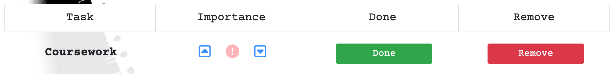
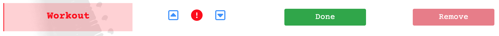
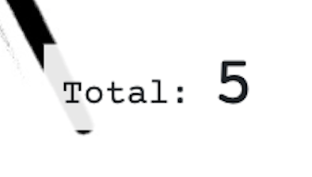
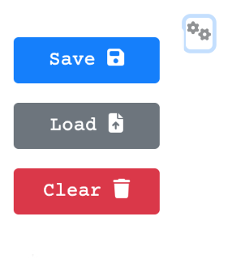

# Task List Creator

[Task List Creator](https://mattdunks94.github.io/task-list-creator/) is a fully responsive application for the organised. Users can create, assign, rearrange and [HTML5](https://en.wikipedia.org/wiki/HTML5#:~:text=HTML5%20(Hypertext%20Markup%20Language%205,as%20the%20HTML%20Living%20Standard.)), [CSS3](https://en.wikipedia.org/wiki/CSS), [Javascript](https://en.wikipedia.org/wiki/JavaScript) and [Bootstrap v4.3](https://getbootstrap.com/docs/4.3/getting-started/introduction/) framework.

## Table of Contents:
- [User Experience (UX)](#user-experience-ux)
  - [User Stories](#user-stories)
  - [Design](#design)
    - [Mockup Diagrams](#--mockup-diagrams)
    - [Colour Palette](#--colour-palette)
    - [Typography](#--typography)
    - [Imagery](#--imagery)
  - [Features](#features)
    - [Help Information](#help-information) 
    - [Adding Tasks](#adding-tasks)
    - [Created Task Row](#created-task-row)
      - [Rearrange Tasks](#rearrange-tasks)
      - [Markdown / Assign Tasks](#markdown--assign-tasks)
      - [Removing Tasks](#removing-tasks)
    - [Task Counter](#task-counter)
    - [Settings Dropdown](#settings-dropdown)
      - [Save List](#save-list)
      - [Load List](#load-list)
      - [Clear List](#clear-list)
    - [Alerts](#alerts)
- [Testing](#testing)
  - [HTML Validation](#html-validation)
  - [CSS Validation](#css-validation)
  - [JS Validation](#js-validation)
  - [Lighthouse Report](#lighthouse-report)
- [Deployment](#deployment)
- [Features for the Future](#features-for-the-future)
- [Bugs & Errors](#bugs--errors)
- [Technologies Used](#technologies-used)
  - [Languages Used](#languages-used)
  - [Frameworks, Libraries & Programs Used](#frameworks-libraries--programs-used)
- [Credits](#credits)
  - [Code](#code)
  - [Media](#media)
  - [Inspiration](#inspiration)
 
## User Experience (UX)

### User Stories
### Design
#### - Mockup Diagrams:
#### - Colour Palette:

The colour palette for this app consists of mainly black and white, creating a monochrome theme. The other colours, that are used within this app, are [Bootstrap V4.3 Colors](https://getbootstrap.com/docs/4.3/utilities/colors/#color) . These colours are mainly used for alerts and buttons and stand out from the monochrome theme.

#### - Typography:
#### - Imagery:

## Features
### Help Information:
(For Large Screens, Tab List)  

(For Small Screens, Accordion Collapse) 

The help information feature contains information on how to operate the app. This feature appears via a button click, this button being  
[Font Awesome's Question Icon](https://fontawesome.com/search?q=question&o=r&m=free) in the top left of the screen, and is displayed using [Bootstrap V4.3 Modal](https://getbootstrap.com/docs/4.3/components/modal/). There are 2 variations of this feature for certain screen types. The 'Help Info' for large screens is [Bootstrap V4.3 Tablist Element](https://getbootstrap.com/docs/4.3/components/list-group/#tab). 
For smaller screens, the 'Help Info' feature is displayed using [Bootstrap V4.3 Accordion Collapse](https://getbootstrap.com/docs/4.3/components/collapse/#accordion-example). The reason for using two different variations to display the information is because when resizing the window, the tab list variation did not work, was not very responsive. This is because it is displayed horizontally and needed to change to a vertical list for smaller screens. I originally changed the tab list to a vertical list, for smaller devices, but this caused the 'Help Info' feature to be too long, meaning the user would have to scroll down to reveal all app operations. This lead to me looking for an alternative, hence the accordion variation. 
The accordion variation is ideal for smaller screens because each 'Help Info' section can be collapsed which saves space on screen and avoids the user having to scroll down.

### Adding Tasks
 
The adding tasks feature allows users to add their own tasks to their task list. This feature consists of an input element and [Bootstrap v4.3 Button Component](https://getbootstrap.com/docs/4.3/components/buttons/). The input element includes a placeholder asking the user 'What tasks need doing?', indicating to the user that this is the element where you type in your tasks. The button consists of 'Add Task' text along with [Font Awesome's Plus Icon](https://fontawesome.com/icons/plus?f=classic&s=solid), indicating to the user that this button will add something.  
When this 'Add Task +' button is clicked, it'll append their task to their list below this feature but only if they've typed a task in the input element (see [Alerts](#alerts) for more info). Alternatively, the user can press the 'Enter' key on their keyboard, instead of clicking the button, to carry out the same operation.

### Created Task Row

Once the user has created a task, it is appended, along with other features, in it's own 'task row'. A created task row consists of 4 columns that include the following features: 
- Task Name (1st Column)
- Up Button (2nd Column)
- Important Button (2nd Column)
- Down Button (2nd Column)
- Done Button (3rd Column)
- Remove Button (4th Column)

This 'Task Row' is created using [Bootstrap V4.3 Horizontal List Group](https://getbootstrap.com/docs/4.3/components/list-group/#horizontal).

### Rearrange Tasks
This feature allows user's to rearrange their tasks within their list. The user can achieve this by simply clicking on either the up or down buttons, which are displayed in the second column within the [Created Task Row](#created-task-row). 
Clicking the up button moves the desired task up one place and clicking the down button moves the desired task down one place. Both buttons consist of [Font Awesome](https://fontawesome.com/) icons, [Square Caret Up Icon](https://fontawesome.com/icons/square-caret-up?f=classic&s=regular) for the up button and [Square Caret Down Icon](https://fontawesome.com/icons/square-caret-down?f=classic&s=regular) for the down button. 
This feature is useful for arranging tasks in level of importance (top being important, bottom being less important).

### Markdown / Assign Tasks
This feature gives user's the ability to markdown/assign tasks as 'done' or 'important'.  

To markdown tasks as 'done' the user simply clicks on the 'Done' button, which is displayed within the 3rd column in the [Created Task Row](#created-task-row) and is a toggle feature. Once clicked, the user's created task name is highlighted with a trasparent green background, solid green left-border and the text striked through indicating the task is done. Being a toggled feature, when clicked again these highlighted effects are removed from the created task name element. 
I used [Bootstrap V4.3 Success Button](https://getbootstrap.com/docs/4.3/components/buttons/) as the 'Done' button because the colour (green) visually indicates something successful, positive and adding a striked through style on the task name text creates a checklist effect. 

    
Done Task Markdown

  
  

To assign a task as 'important' the user clicks the 'i' button, which is displayed within the 2nd column in the [Created Task Row](#created-task-row), between the up and down buttons, and is also a toggle feature. Once clicked, the user's created task name is highlighted with a trasparent red background, solid red left-border and red text colour. This button click also disables the 'Remove' button, this avoids an important task from being removed by accident. 
Being a toggled feature, when clicked again these highlighted effects are removed from the created task name element and the 'Remove' buttons functionality is reinstated. 
 
This button consists of [Font Awesome's Circle Exclamation Icon](https://fontawesome.com/icons/circle-exclamation?f=classic&s=solid) in white and styled with a  transparent red background (see [Created Task Row](#created-task-row)), but when clicked it is then styled in a solid red indicating the button has been clicked. I decided to style this button in red because red indicates a sense of importance, urgency. 

    
Assigned Important Task

  
  

### Removing Tasks
This feature allows the user to remove any unwanted or completed tasks. The user can achieve this by clicking on the 'Remove' button, displayed within the 4th column in the [Created Task Row](#created-task-row). I used [Bootstrap V4.3 Danger Button](https://getbootstrap.com/docs/4.3/components/buttons/) as the 'Remove' button because of the colour of the button being red which indicates danger, warning. 

### Task Counter

The Task Counter feature keeps count of the number of existing tasks. Everytime the user adds a task the counter increments, everytime the user removes a task the counter decrements. 

### Save, Load & Clear Dropdown

This dropdown contains 3 features:
- Save Task List
- Load Saved Task List
- Clear Task List

These features are accessible via [Font Awesome's Gears Icon](https://fontawesome.com/icons/gears?f=classic&s=solid) which is displayed in the top right corner of a device screen. When clicked [Bootstrap V4.3 Dropleft Dropdown Component](https://getbootstrap.com/docs/4.3/components/dropdowns/) is revealed consisting of the following 3 features:

#### Save List
If the user wants to save their created task list they can do by clicking on the 'Save' button. This feature saves the user's task list to the [Local Storage](https://developer.mozilla.org/en-US/docs/Web/API/Window/localStorage), meaning their list is accessible even when closing the app/window. 
This button is a [Bootstrap V4.3 Primary Button](https://getbootstrap.com/docs/4.3/components/buttons/) and consists of [Font Awesome's Floppy Disk Icon](https://fontawesome.com/icons/floppy-disk?f=classic&s=solid). 

#### Load List
If the user has a saved task list, they can then load their list via the 'Load' button. This feature, when clicked, renders the user's saved task items, in the order the tasks were created, to the DOM. This button is a [Bootstrap V4.3 Secondary Button](https://getbootstrap.com/docs/4.3/components/buttons/), as it is the second item in the [Settings Dropdown](#settings-dropdown), and includes [Font Awesome's File Arrow Up Icon](https://fontawesome.com/icons/file-arrow-up?f=classic&s=solid). 

#### Clear List
If the user wants to remove all tasks and start a new list they can achieve this by clicking on the 'Clear' button, which is the 3rd item in the [Settings Dropdown](#settings-dropdown). When clicked, the users task list is deleted, not just from the DOM but also from local storage meaning they cannot reload their recently deleted list. This button is a [Bootstrap V4.3 Danger Button](https://getbootstrap.com/docs/4.3/components/buttons/) and has [Font Awesome's Trash Icon](https://fontawesome.com/icons/trash?f=classic&s=solid). 

#### Alerts

## Testing
### HTML Validation
I used [W3C Markup Validation Service](https://validator.w3.org/) to test all HTML files.

    
HTML Validation Results

  
  

### CSS Validation
I used [W3C Markup Validation Service](https://validator.w3.org/) to test all CSS files via direct input.

    
CSS Validation Results

  
  

### JS Validation
I used [ES6 Syntax Check - PiliApp](https://www.piliapp.com/syntax-check/es6/) to test all Javascript files.

    
index.js Validation Results

  
  

    
help-info.js Validation Results

  
  

    
save-load.js Validation Results

  
  

    
alerts.js Validation Results

  
  

    
media-queries.js Validation Results

  
  

### Lighthouse Report
I used [Google Chrome DevTools Lighthouse](https://developer.chrome.com/docs/lighthouse/overview/) was used to test performance, accessibility, best practises and SEO.

  
Homepage Lighthouse Report

  

## Deployment

## Features for the Future

## Bugs & Errors

## Technologies Used

### Languages Used
### Frameworks, Libraries & Programs Used

## Credits

### Code 
### Media 
### Inspiration
