# Task List Creator

[Task List Creator](https://mattdunks94.github.io/task-list-creator/) is a fully responsive application for the organised. Users can create, assign, rearrange and [HTML5](https://en.wikipedia.org/wiki/HTML5#:~:text=HTML5%20(Hypertext%20Markup%20Language%205,as%20the%20HTML%20Living%20Standard.)), [CSS3](https://en.wikipedia.org/wiki/CSS), [Javascript](https://en.wikipedia.org/wiki/JavaScript) and [Bootstrap v4.3](https://getbootstrap.com/docs/4.3/getting-started/introduction/) framework.

## Table of Contents:
- [User Experience (UX)](#user-experience-ux)
  - [User Stories](#user-stories)
  - [Design](#design)
    - [Mockup Diagrams](#--mockup-diagrams)
    - [Colour Palette](#--colour-palette)
    - [Typography](#--typography)
    - [Imagery](#--imagery)
  - [Features](#features)
    - [Help Information](#help-information) 
    - [Adding Tasks](#adding-tasks)
    - [Created Task Row](#created-task-row)
      - [Rearrange Tasks](#rearrange-tasks)
      - [Assigning Tasks](#assigning-tasks)
      - [Removing Tasks](#removing-tasks)
    - [Save List](#save-list)
    - [Load List](#load-list)
    - [Clear List](#clear-list)
    - [Alerts](#alerts)
- [Testing](#testing)
  - [HTML Validation](#html-validation)
  - [CSS Validation](#css-validation)
  - [JS Validation](#js-validation)
  - [Lighthouse Report](#lighthouse-report)
- [Deployment](#deployment)
- [Features for the Future](#features-for-the-future)
- [Bugs & Errors](#bugs--errors)
- [Technologies Used](#technologies-used)
  - [Languages Used](#languages-used)
  - [Frameworks, Libraries & Programs Used](#frameworks-libraries--programs-used)
- [Credits](#credits)
  - [Code](#code)
  - [Media](#media)
  - [Inspiration](#inspiration)
 
## User Experience (UX)

### User Stories
### Design
#### - Mockup Diagrams:
#### - Colour Palette:
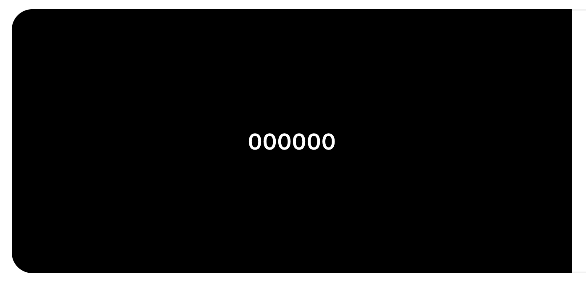
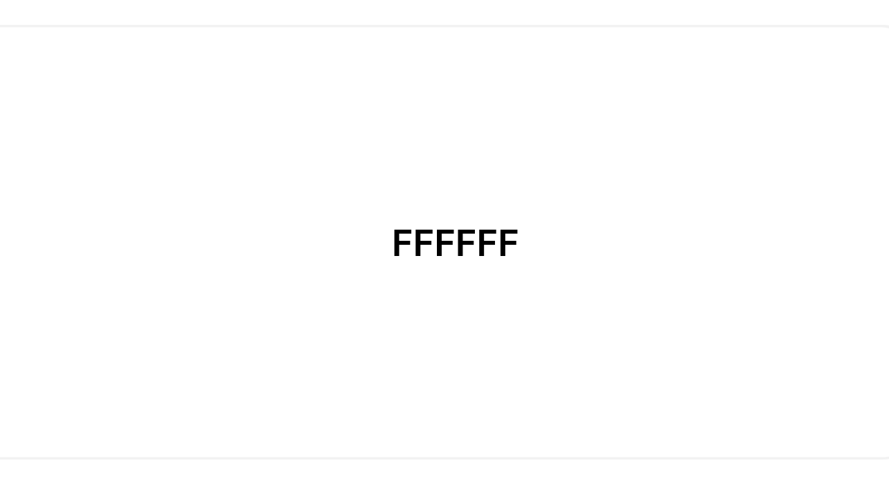

The colour palette for this app consists of mainly black and white, creating a monochrome theme. The other colours, that are used within this app, are [Bootstrap V4.3 Colors](https://getbootstrap.com/docs/4.3/utilities/colors/#color) . These colours are mainly used for alerts and buttons and stand out from the monochrome theme.

#### - Typography:
#### - Imagery:

## Features
### Help Information:
(For Large Screens, Tab List)  
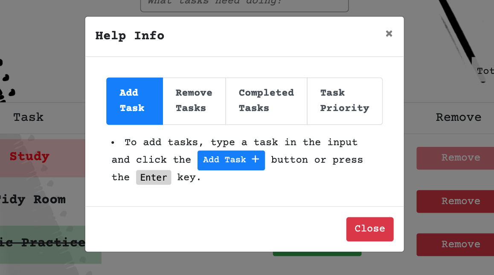

(For Small Screens, Accordion Collapse) 
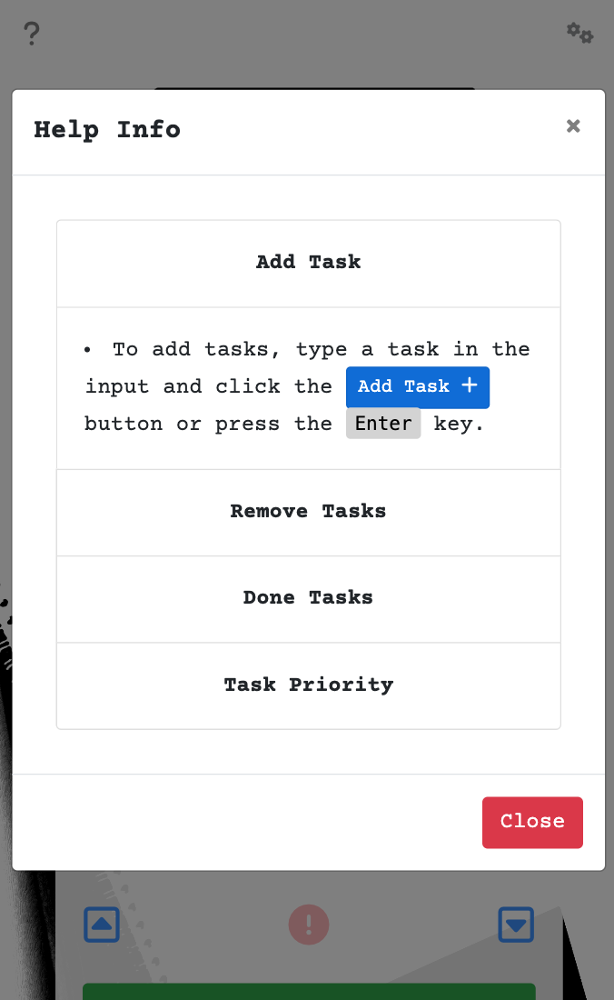

The help information feature contains information on how to operate the app. This feature appears via a button click, this button being  
[Font Awesome's Question Icon](https://fontawesome.com/search?q=question&o=r&m=free) in the top left of the screen, and is displayed using [Bootstrap V4.3 Modal](https://getbootstrap.com/docs/4.3/components/modal/). There are 2 variations of this feature for certain screen types. The 'Help Info' for large screens is [Bootstrap V4.3 Tablist Element](https://getbootstrap.com/docs/4.3/components/list-group/#tab). 
For smaller screens, the 'Help Info' feature is displayed using [Bootstrap V4.3 Accordion Collapse](https://getbootstrap.com/docs/4.3/components/collapse/#accordion-example). The reason for using two different variations to display the information is because when resizing the window, the tab list variation did not work, was not very responsive. This is because it is displayed horizontally and needed to change to a vertical list for smaller screens. I originally changed the tab list to a vertical list, for smaller devices, but this caused the 'Help Info' feature to be too long, meaning the user would have to scroll down to reveal all app operations. This lead to me looking for an alternative, hence the accordion variation. 
The accordion variation is ideal for smaller screens because each 'Help Info' section can be collapsed which saves space on screen and avoids the user having to scroll down.

### Adding Tasks
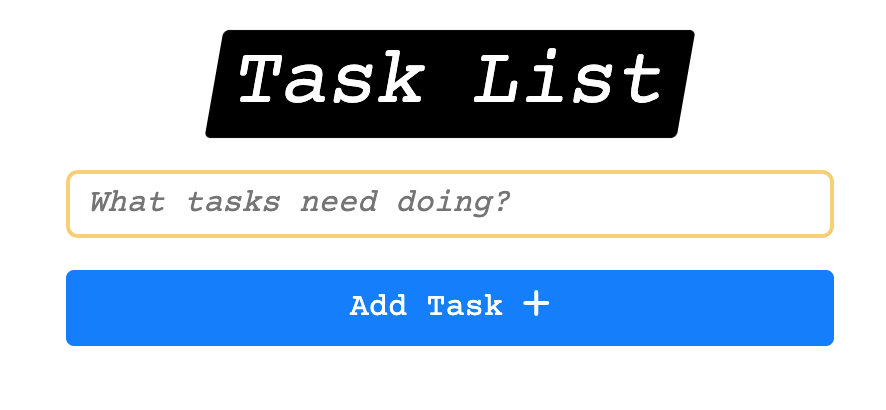 
The adding tasks feature allows users to add their own tasks to their task list. This feature consists of an input element and [Bootstrap v4.3 Button Component](https://getbootstrap.com/docs/4.3/components/buttons/). The input element includes a placeholder asking the user 'What tasks need doing?', indicating to the user that this is the element where you type in your tasks. The button consists of 'Add Task' text along with [Font Awesome's Plus Icon](https://fontawesome.com/icons/plus?f=classic&s=solid), indicating to the user that this button will add something.  
When this 'Add Task +' button is clicked, it'll append their task to their list below this feature but only if they've typed a task in the input element (see [Alerts](#alerts) for more info). Alternatively, the user can press the 'Enter' key on their keyboard, instead of clicking the button, to carry out the same operation.

### Created Task Row

Once the user has created a task, it is appended, along with other features, in it's own 'task row'. A created task row consists of the following features: 
- Task Name
- Up Button
- Important Button
- Down Button
- Done Button
- Remove Button

### Rearrange Tasks
This feature allows user's to rearrange their tasks within their list. The user can achieve this by simply clicking on either the up or down buttons, which are displayed in the second column within the [Created Task Row](#created-task-row). 
Clicking the up button moves the desired task up one place and clicking the down button moves the desired task down one place. Both buttons consist of [Font Awesome](https://fontawesome.com/) icons, [Square Caret Up Icon](https://fontawesome.com/icons/square-caret-up?f=classic&s=regular) for the up button and [Square Caret Down Icon](https://fontawesome.com/icons/square-caret-down?f=classic&s=regular) for the down button. 
This feature is useful for arranging tasks in level of importance (top being important, bottom being less important).

### Assigning Tasks

### Removing Tasks

### Save List

### Load List

### Clear List

### Alerts

## Testing
### HTML Validation
I used [W3C Markup Validation Service](https://validator.w3.org/) to test all HTML files.

    
HTML Validation Results

  
  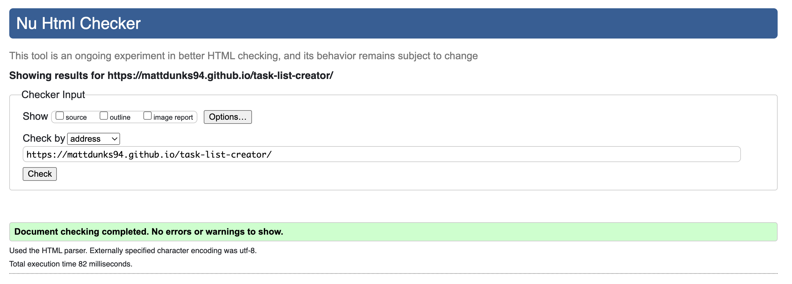

### CSS Validation
I used [W3C Markup Validation Service](https://validator.w3.org/) to test all CSS files via direct input.

    
CSS Validation Results

  
  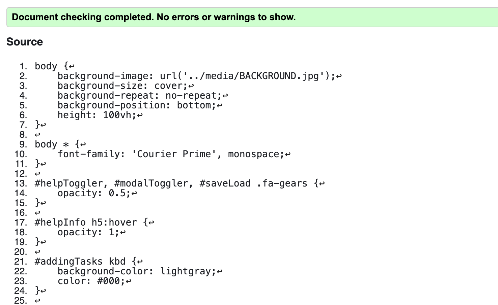

### JS Validation
I used [ES6 Syntax Check - PiliApp](https://www.piliapp.com/syntax-check/es6/) to test all Javascript files.

    
index.js Validation Results

  
  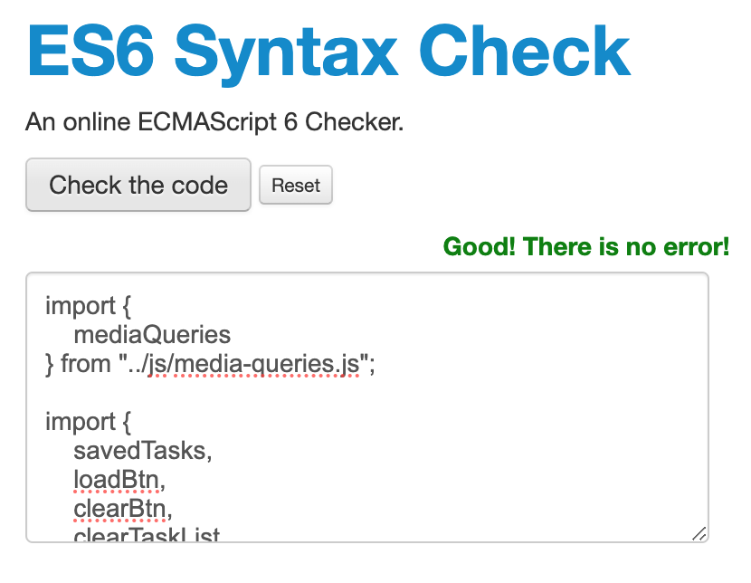

    
help-info.js Validation Results

  
  

    
save-load.js Validation Results

  
  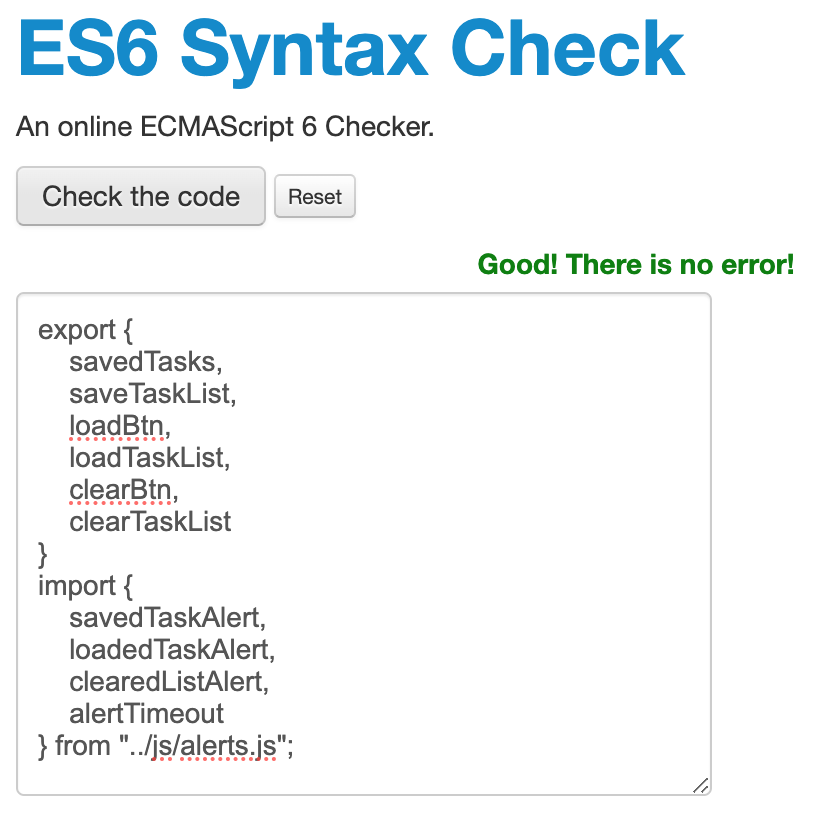

    
alerts.js Validation Results

  
  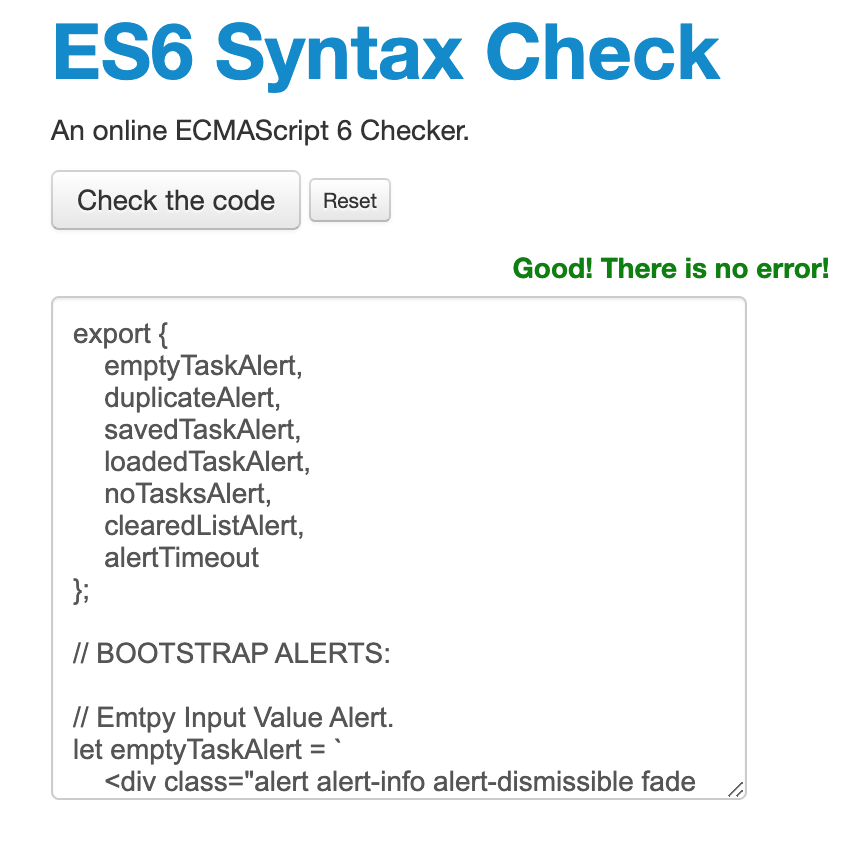

    
media-queries.js Validation Results

  
  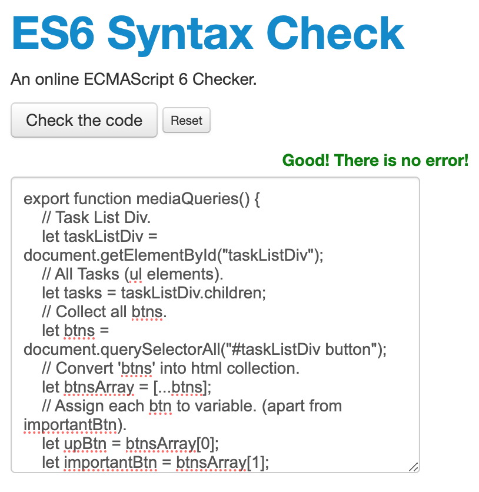

### Lighthouse Report
I used [Google Chrome DevTools Lighthouse](https://developer.chrome.com/docs/lighthouse/overview/) was used to test performance, accessibility, best practises and SEO.

  
Homepage Lighthouse Report

  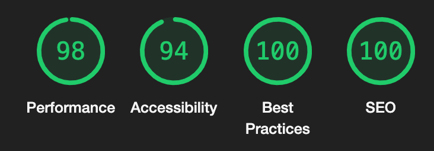

## Deployment

## Features for the Future

## Bugs & Errors

## Technologies Used

### Languages Used
### Frameworks, Libraries & Programs Used

## Credits

### Code 
### Media 
### Inspiration
